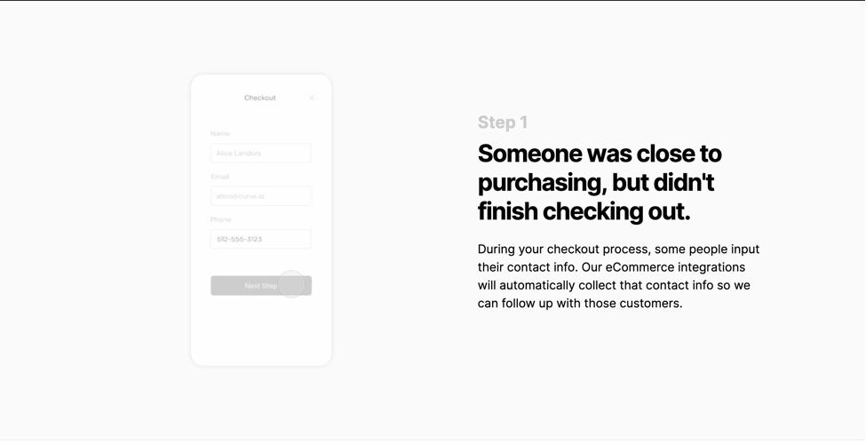
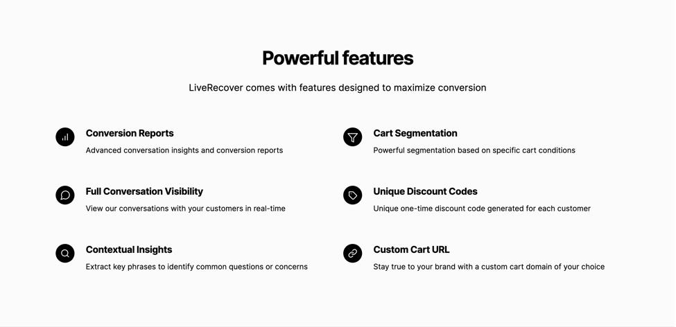
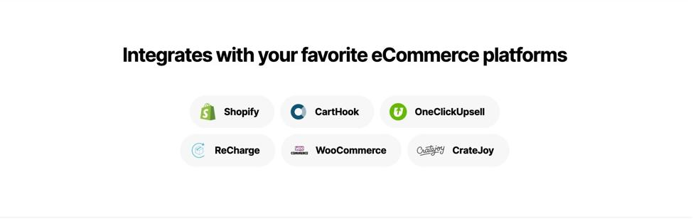
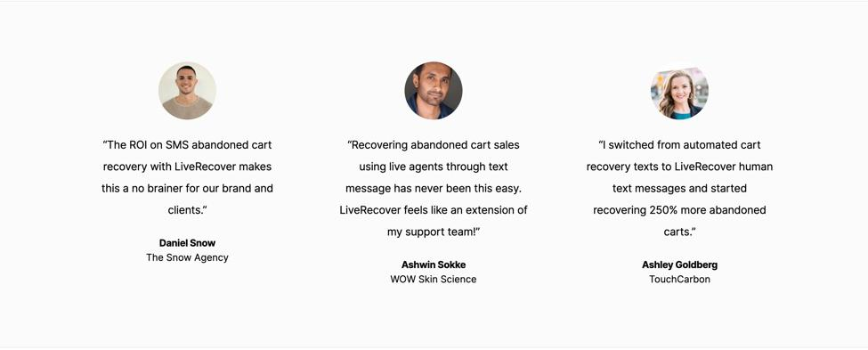

Trong series này mình sẽ cùng các bạn chọn ra những layout của nhiều website khác nhau, sau đó phân tích cây HTML nhé, có áp dụng quy tắc đặt tên class BEM.

- Tham khảo thêm về BEM: [http://getbem.com/](http://getbem.com/)

Layout URL: <a href="https://screenlane.com/screen/liverecover-marketing-site-fc1/">link to screenlane</a>🚀

## General Layout


``` 
body
|__ header
|  |__ nav.top-nav
|
|__ main
|  |__ section.banner
|  |__ section.why-us
|  |__ section.clients
|  |__ section.title-box
|  |__ section.step
|  |__ section.step
|  |__ section.step
|  |__ section.step
|  |__ section.feature
|  |__ section.integration
|  |__ section.testimonial
|  |__ section.cta
|
|__ footer
```
## section.top-bar


```
nav.top-bar
|__ div.container
|    |__ div.top-bar__row
|       |__ div.top-bar__logo > img
|       |   
|       |__ div.top-bar__menu
|       |   |__ ul.menu-list > li*5 > a 
|       |
|       |__ div.top-bar__actions > button
```
## section.banner


```
section.banner
|__ div.container
|   |__ div.banner__row
|       |__ div.banner__col
|       |   |__ div.banner-content
|       |       |__ h1
|       |       |__ p
|       |       |__ button
|       |   
|       |__ div.banner__col
|           |__ div.banner-thumbnail
|               |__img
```

## section.why-us


```
section.why-us
|__ div.container
|   |__ ul.why-us__list          
|       |__ li*3
|           |__div.reason-item
|              |__ div.reason-item__icon > i   // icon
|              |__ h3.reason-item__title
|              |__ p.reason-item__desc
```

## section.clients


```
section.clients
|__ div.container
|   |__ p.clients__subtitle
|   |
|   |__ ul.clients__list
|       |__ li*5
|           |__ img
```
## section.title-box


```
section.title-box
|__ div.container
|   |__ h2.title-box__title
```
## section.step

- Các bạn để ý các section dưới đây nó cùng một styles, nên mình cần làm một class chung là được. Còn việc trái phải của hình ảnh thì chỉ cần dùng css order để move hình ảnh lên trước là xong 😜




```
section.step
|__ div.container
|   |__ div.step__row
|       |__ div.step__col
|       |   |__ div.step__content
|       |       |__ h5
|       |       |__ h4
|       |       |__ p
|       |       |__ small // strong
|       |
|       |__ div.step__col (.step__col--first thêm class này để đẩy image qua bên trái)
|           |__ div.step__image
|               |__ img
```

## section.feature



```
section.feature
|__ div.container
|   |__ h2.feature__title
|   |__ p.feature__subtitle
|   |__ ul.feature__list > li*6 > div.feature-item


div.feature-item
|__ div.feature-item__icon
|   |__ img
|
|__ div.feature-item__main
|   |__p.feature-item__title
|   |__p.feature-item__desc
```

## section.integration



```
section.integration
|__ div.container
|   |__ div
|       |__ h3.integration__title
|       |__ ul.integration__list > li*6 > a > img
```
## section.testimonial



```
section.testimonial
|__ div.container
|   |__ ul.testimontial__list
|       |__ li*3
|           |__ div.testimontial-item
|               |__ img.testimontial-item__avatar
|               |__ p.testimontial-item__feedback
|               |__ p.testimontial-item__name
|               |__ p.testimontial-item__company
```

## section.cta


```
section.cta-box
|__ div.cta-box__container
|   |__ h2.cta-box__title
|   |__ p.cta-box__decs
|   |__ button.cta-box__submit
```

## footer


```bash
footer.footer
|__ div.container
        |__ div.footer__row
        |   |__ div.footer__col
        |   |          |__ div.footer__logo > img
        |   |          |__ p.footer__subtitle
        |   |          |__ ul.footer__social > li*3 > i // icon
        |   |
        |   |__ div.footer__col
        |       |__ul.footer__menu > li*4 > div.menu-group
        |
        |__ p.footer__copyright


div.menu-group
|__ p.menu-group__title
|__ ul.menu-group__list > li*n > a
```

<small>Writing in 2021 by <a href="https://www.linkedin.com/in/hungle-ag/">HungLe </a>with ❤️ Easy Frontend.</small>
