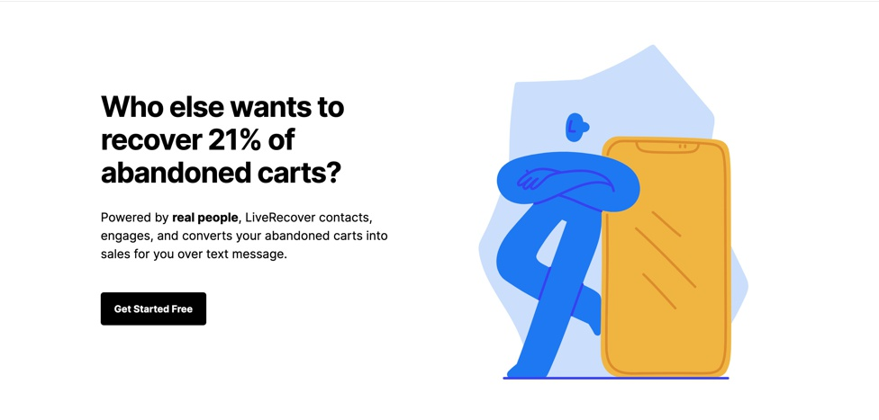
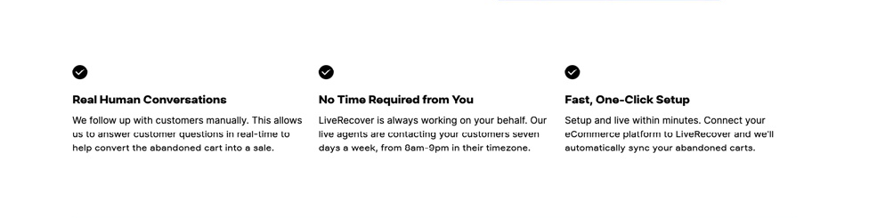
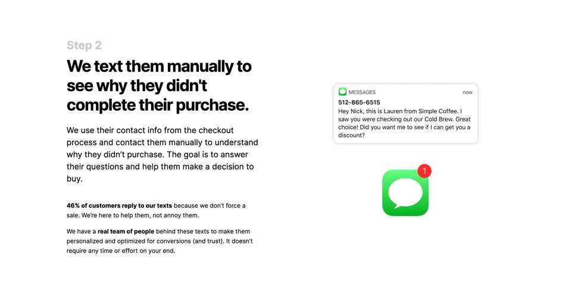
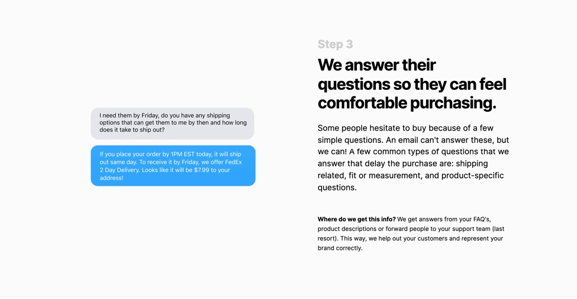
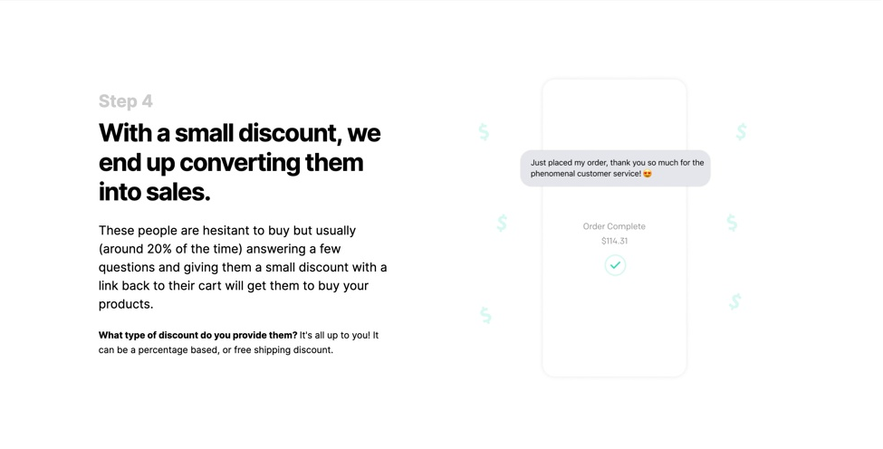
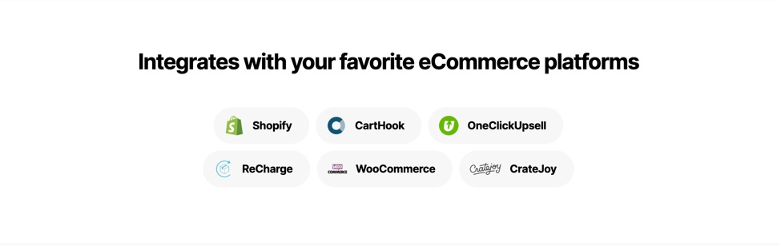
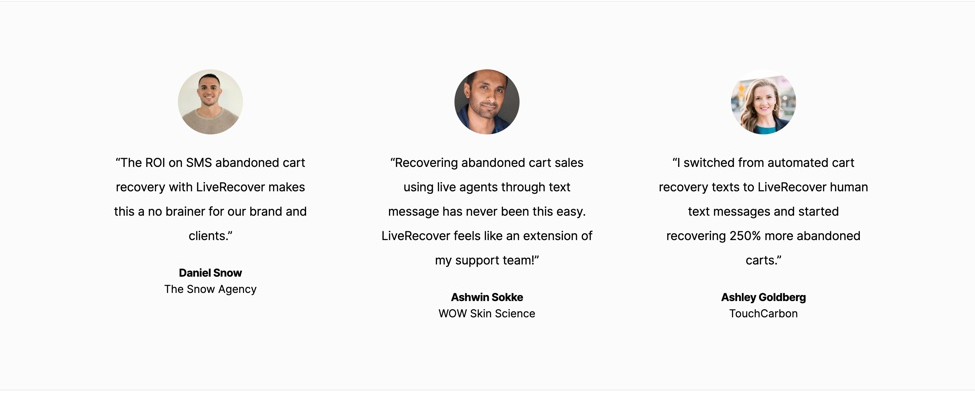
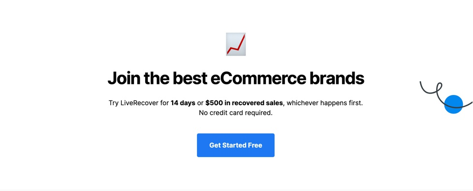
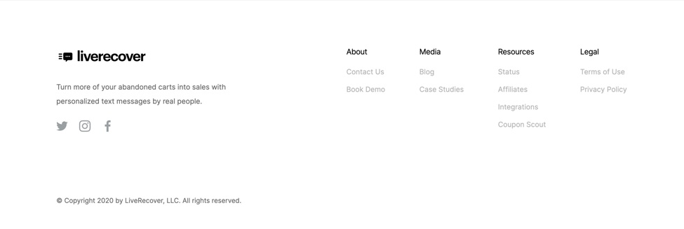

Layout URL: <a href="https://screenlane.com/screen/liverecover-marketing-site-fc1/">link to screenlane</a>🚀

## General Layout


``` 
body
|__ header
|  |__ nav.top-nav
|
|__ main
|  |__ section.banner
|  |__ section.why-us
|  |__ section.clients
|  |__ section.title-box
|  |__ section.step
|  |__ section.step
|  |__ section.step
|  |__ section.step
|  |__ section.feature
|  |__ section.integration
|  |__ section.testimonions
|  |__ section.cta
|
|__ footer

```
## section.top-bar


```
nav.top-bar
|__ div.container
|    |__ div.top-bar__row
|       |__ div.top-bar__col
|       |   
|       |__ div.top-bar__col
|       |   |__ ul.menu-list > li*5 > a 
|       |
|       |__ div.top-bar__col
|          

```
## section.banner



```
section.banner
|__ div.container
|   |__ div.banner__row
|       |__ div.banner__col
|       |   |__ div.banner-title__main
|       |       |__ h1.banner-title__headline
|       |       |__ p.banner-title__subtitle
|       |       |__ button.banner-title__btn
|       |   
|       |__ div.banner__col
|           |__ div.banner-thumbnail
|               |__img


```

## section.why-us



```
section.why-us
|__ div.container
|   |__ ul.why-us__list          
|       |__ li*3
|           |__div.reason-item
|              |__ div.reason-item__thumbnail > i   // icon
|              |__ h3.reason-item__title
|              |__ p.reason-item__desc

Note:  we didn't need to set "class" here, we set class when element needed to style different.

```

## section.clients


```
section.clients
|__ div.container
|   |__ p.clients__subtitle
|   |
|   |__ ul.clients__thumbnail
|       |__ li*5
|           |__ img


```
## section.title-box


```
section.title-box
|__ div.container
|   |__ div.title-box__title
|       |__ h4

```
## section.step






```
section.step
|__ div.container
|   |__ div.step__row
|       |__ div.step__col
|       |   |__ div.step__content
|       |       |__ h5
|       |       |__ h4
|       |       |__ p
|       |       |__ small // strong
|       |
|       |__ div.step__col    
|           |__ div.step__image
|               |__ img


```

## section.feature


```
section.feature
|__ div.container
|   |__ div.feature__contents
|       |__ h2.feature__title
|       |__ p.feature__subtitle
|       |__ ul > li*6
|           |__ div.feature__item
|               |   |__ img    //icon
|               |
|               |__ div.feature__main
|                       |__p.feature-item__title
|                       |__p.feature-item__desc

```

## section.integration



```
section.integration
|__ div.container
|   |__ div
|       |__ h3
|       |__ ul > li*6 > div > a > img

```
## section.testimonions



```
section.testimonions
|__ div.container
|   |__ ul.testimontion-list
|       |__ li*3
|           |__ div.testimontion-item
|               |__ img.testimontion-item__thumbnail
|               |__ p.testimontion-item__desc
|               |__ p.testimontion-item__name
|               |__ p.testimontion-item__subtitle

```

## section.cta



```
section.cta-box
|__ div.container
|   |__ div.cta-box__main
|       |__ h2.cta-box__title
|       |__ p.cta-box__decs
|       |__ button.cta-box__btn

```

## footer



```
footer
|__ section.footer
    |__ div.container
        |__ div.footer__row
        |   |__ div.footer__col
        |   |          |__ div.footer-logo > img
        |   |          |__ p.footer-subtitle
        |   |          |__ ul.footer-social > li*3 > i // icon
        |   |
        |   |__ div.footer__col
        |       |__ul.footer-menu > li*4 > a
        |
        |__ p.copyright

```


<small>Writing by <a href="https://www.linkedin.com/in/hungle-ag/">HungLe </a>with ❤️ Easy Frontend. Goodluck!</small>
