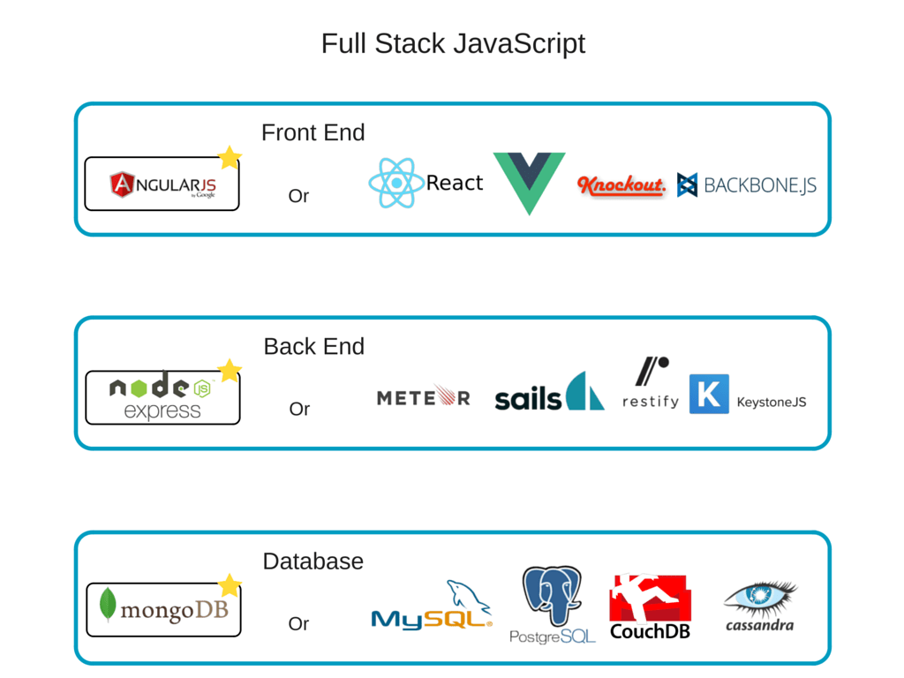
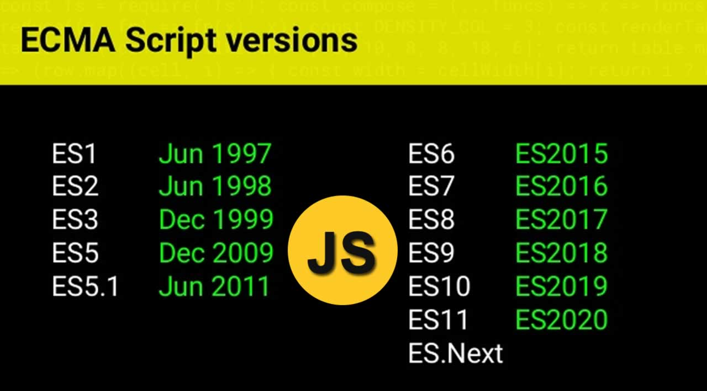

Xin chào mọi người, bên dưới là phần sơ lược tổng quan về những kiến thức cơ bản trong Javascript, nhằm giúp các bạn có cái nhìn tổng quan về Javascript nha 😍

> Lưu ý mỗi phần sẽ có link tham khảo để mọi người đọc và tỉm hiểu thêm nha, chứ mình không cover hết trong một bài này nè 😉

<!--truncate-->

Nội dung chương trình 8 tuần, 24 buổi: 

- 2 tuần đầu để học hỏi, tìm hiểu cơ bản, nền tảng của Javascript.
- 1 tuần về OOP + Giải thuật
- 1 tuần làm với DOM + Game
- 1 tuần làm việc với API
- 1 tuần làm việc với Brower API 
- 1 tuần nói về các chủ đề nâng cao 
- 1 tuần support + prepare for ReactJS


## 1. JS là gì?

Ngôn ngữ lập trình mà trình duyệt web có thể hiểu và thực thi ngay trên trình duyệt. Hiện nay thì Javascript còn thể chạy được ở phía server nhờ có `NodeJS` - runtime environment của Javascript.

## 2. JS làm được gì?

- Lập trình tương tác và xử lý sự kiện trên Web.
- Dựng API server với `NodeJS` + `ExpressJS`
- Nhiều database được viết bằng JS: NeDB, pouchdb, lovefield, ...



## 3. EcmaScript (ES) version

- 2015, ES ra version 6 và hay được nhắc tới là ES6.
- Sau đó, quyết định ra specs hằng năm nên lấy năm cho dễ nhớ thay vì version.
- Nên giờ mình sẽ gọi là ES2017, ES2018, ES2019, ES2020, ... nhé hehee 



## 4. Scope

- `Global scope`: có phạm vi toàn cục, không nằm trong bất cứ hàm nào. 
- `Local scope`: có phạm vi trong 1 hàm được khai báo.
- `Block scope`: có phạm vi trọng cặp ngoặc `{}` gần nhất.
- `Lexical scope`: function con có thể truy cập tới các thuộc tính của function cha.

> Link tham khảo: [https://dmitripavlutin.com/javascript-scope/](https://dmitripavlutin.com/javascript-scope/)

## 5. use strict

```js
"use strict"
console.log('Now writing js in strict mode');

name = 'Easy Frontend';
// This will cause error in strict mode 
```

Tạm hiểu nôm na đây là một cờ cho chúng ta biết là mình muốn sử dụng code theo mode mới. Có những thứ ở mode cũ không sao, chạy bình thường nhưng qua mode mới thì sẽ báo lỗi đó.

> Link tham khảo: [https://developer.mozilla.org/en-US/docs/Web/JavaScript/Reference/Strict_mode](https://developer.mozilla.org/en-US/docs/Web/JavaScript/Reference/Strict_mode) 

## 6. Function trong JS

Function declaration

```js
function add(a, b) {
  // Make sure params are valid
  if (a < 0 || b < 0) return 0;

  // Calculate and return the result
  return a + b;
}
```

Function expression

```js
const add = function(a, b) {
  // Make sure params are valid
  if (a < 0 || b < 0) return 0;

  // Calculate and return the result
  return a + b;
}
```

Arrow funtion 

```js
const add = (a, b) => {
  // Make sure params are valid
  if (a < 0 || b < 0) return 0;

  // Calculate and return the result
  return a + b;
}
```

## 7. Number

- Có số nguyên (Integer) hoặc số thực (Float)

```js
const number = 10; // integer
const radius = 2.35; // float
```

- Cẩn thận khi cộng trừ trong javascript, sẽ có nhiều điều bất ngờ đó.

```js
const a = 1 + '23'; // a = '123' tương đương nối chuỗi 
const b = 1 + 2 + '3'; // b = '33' 
```

- Số có thể chuyển sang chuỗi và ngược lại

```js
const number = 123;
const numberString = number.toString(); // number to string 
const parsedNumber = Number.parseInt(numberString); // string to number
```

- Làm tròn số

```js
const number = 2.75;
const roundedNumber = Math.round(number); // 2.8
```

- Các hàm tính toán có sẵn
  - Math.random()
  - Math.abs()
  - Math.min()
  - Math.max()
  - Math.sqrt()

> Link tham khảo: [https://javascript.info/number](https://javascript.info/number)


## 8. String

- Chuỗi dùng single quote.

```js
const name = 'Easy Frontend';
```

- Dùng template expression khi muốn thêm biến vào chuỗi.

```js
const name = 'Easy Frontend';
const helloString = `Xin chao ${name}`;
```

- Cắt chuỗi, gộp chuỗi

```js
const sentence = 'Javascript is powerful';

// split sentence into array by space
// ['Javascript', 'is', 'powerful']
const words = sentence.split(' ');

// merge array and add space between words
// Javascript is powerful
const joinWordsWithSpace = words.join(' '); // 
```

- Kiểm tra nội dung có trong chuỗi

```js
const hasJavascript = 'super javascript'.includes('javascript');
```

> Link tham khảo: [https://javascript.info/string](https://javascript.info/string)

## 9. Boolean

- Kiểu dữ liệu true / false.

```js
const isActive = true;
const isDisable = false;
```

- Ternary operator

```js
const isIronman = true;
const power = isIronman ? 100 : 90; // power = 100
```

- Nullish coalescing operator '??'

```js
const power = 0 ?? 100; // power = 0
```

## 10. Object

- Kiểu dữ liệu phức tạp, có nhiều key, mỗi key lại là một kiểu dữ liệu khác nhau.

```js
const student = {
  name: 'Hau',
  isInstructor: true,
  age: 18,
  hobbies: ['sharing', 'music']
}
```

- Loop qua các keys của một object.

```js
Object.keys(student).forEach(key => {
  console.log(key, student[key]);
})
```

- Xóa một key của object.

```js
delete student.age;
```

- Kiểm tra object có dữ liệu không?

```js
if (Object.keys(student).length > 0) {
  console.log('Object has data');
}
```

- Copy object 

```js
// deep clone
const studentB = {
  ...student,
};
```

> Link tham khảo: [https://javascript.info/object](https://javascript.info/object)

## 11. Array

- Kiểu dữ liệu dạng danh sách, mỗi item có một kiểu dữ liệu khác nhau.

```js
const numbers = [1, 2, 3, 4, 5];
const names = ['Hien', 'Hau', 'Hoa'];

const studentList = [
  {
    name: 'Hien',
    age: 18,
  },
  {
    name: 'Hau',
    age: 19,
  },
  {
    name: 'Hoa',
    age: 20,
  },
]
```

- Thêm phần tử mới vào mảng:

```js
numbers.push(6);

studentList.push({
  name: 'Hoang',
  age: 21,
});
```

- Xóa một phần tử ra khỏi mảng:

```js
// delete two items started from index 1
numbers.splice(1, 2);
```

> Link tham khảo: [https://javascript.info/array](https://javascript.info/array)


## 12. Conditional statement

Câu điều kiện để thực thi đoạn code khác nhau khi kiểm tra một điều kiện nào đó.

```js
const isTurnedOn = true;

if (isTurnedOn) {
  console.log('Handle something when isTurnedOn is true');
} else {
  console.log('Handle something when isTurnedOn is false');
}
```


## 13. Switch

Xử lý khác nhau khi một biến có giá trị cố định khác nhau.

```js
const month = 9;

switch (month) {
  case 1: 
    console.log('Jan');
    break;
  case 2: 
    console.log('Feb');
    break;
  // ...
  case 11: 
    console.log('Nov');
    break;
  case 12: 
    console.log('Dec');
    break;
  default:
    console.log('N/A');
}

```

## 14. setTimeout

```js
const timeout = setTimeout(() => {
  console.log('Log after 500ms');
}, 500);

// you can clear timeout when needed
clearTimeout(timeout);
```

## 15. setInterval

```js
const interval = setInterval(() => {
  console.log('Log every 500ms');
}, 500);

// you can clear interval when needed
clearInterval(interval);
```

## 16. Promise

Dùng để xử lý những tác vụ bất đồng bộ trong javascript như gọi API lên server lấy dữ liệu, đợi hàm callback của thư viện bên ngoài thực thi, ...

```js
fetch('https://jsonplaceholder.typicode.com/posts')
  .then((response) => {
    return response.json()
  }).catch((error) => {
    console.log('parsing failed', error)
  })
```


## 17. Async / Await

Cú pháp mới sử dụng thay thế cho then...catch, dễ nhìn hơn, gọn hơn 😍

```js
const fetchData = async () => {
  try {
    const response = await fetch('https://jsonplaceholder.typicode.com/posts');
    return await response.json();
  } catch (error) {
    console.log('parsing failed', error);
  }
}

fetchData();
```

> Từ khóa `await` phải đươc đặt bên trong hàm `async`


## 18. Coding convention

Có nhiều convention khác nhau, nhưng phổ biến là của Airbnb Javascript. 

> Link tại đây: https://github.com/airbnb/javascript


## 19. Testing

Khi viết hàm trong javascript, làm sao viết test cases để kiểm tra xem hàm này chạy có đúng không? Mình dùng Mocha + Chai để setup nhé.

## 20. Các chủ đề nghiên cứu thêm

- Hoisting
- Closure
- IIFI
- Prototype
- this
- Event loop 
- Bind, call and apply
- ...


Chúc các bạn học tốt! 😎

