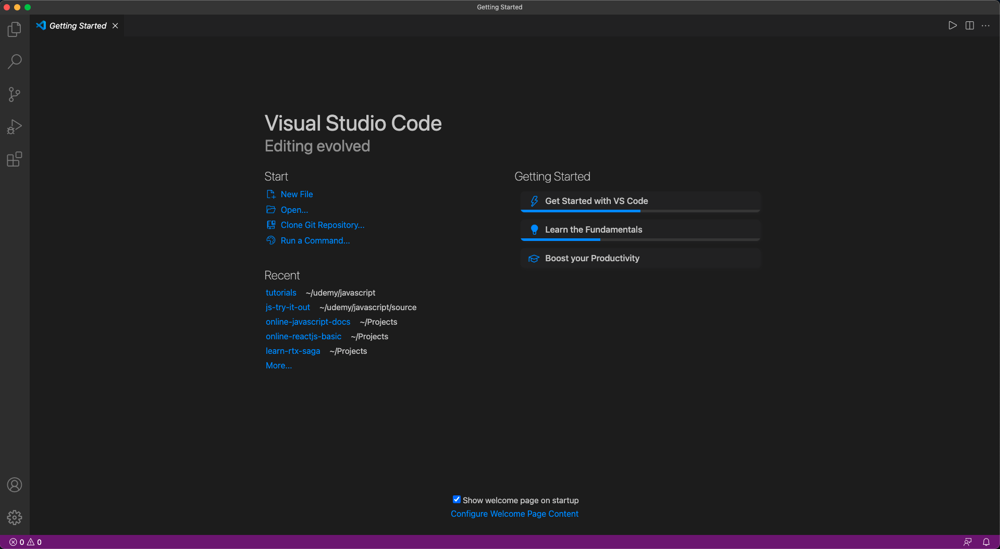

# VSCode và các extensions hữu ích 🎉

## Cài đặt VSCode

- Vào trang chủ [VSCode](https://code.visualstudio.com/)
- Tải file và cài đặt
- Sau khi hoàn tất, mở VSCode lên được giao diện tương tự thế này.
- Bật `Auto format on save`

## Cài đặt VSCode Extensions

| #   | Tên extension                                                                                                      | Mô tả                         |
| --- | ------------------------------------------------------------------------------------------------------------------ | ----------------------------- |
| 1   | [Bracket Pair Colorizer 2](https://marketplace.visualstudio.com/items?itemName=CoenraadS.bracket-pair-colorizer-2) | Highlight cặp ngoặc tương ứng |
| 2   | [JavaScript (ES6) code snippets](https://marketplace.visualstudio.com/items?itemName=xabikos.JavaScriptSnippets)   | Gõ tắt trong javascript       |
| 3   | [ESLint](https://marketplace.visualstudio.com/items?itemName=dbaeumer.vscode-eslint)                               | Tìm bắt lỗi javascript        |
| 4   | [Prettier](https://marketplace.visualstudio.com/items?itemName=esbenp.prettier-vscode)                             | Format code xịn, mịn          |
| 5   | [Code Runner](https://marketplace.visualstudio.com/items?itemName=formulahendry.code-runner)                       | Thực thi code trực tiếp       |
| 6   | [Live Server](https://marketplace.visualstudio.com/items?itemName=ritwickdey.LiveServer)                           | Live preview static web       |
| 7   | [Material Icon Theme](https://marketplace.visualstudio.com/items?itemName=PKief.material-icon-theme)               | Bộ icon đẹp cho folders       |

<DocsJSFooter />
