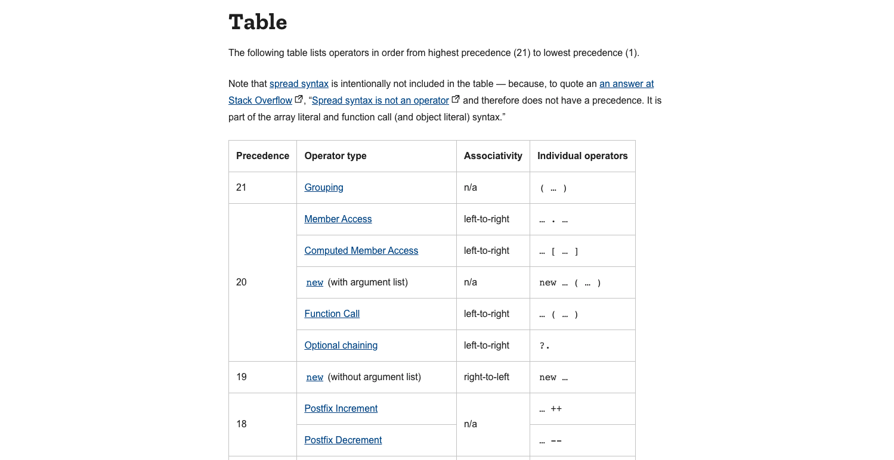

# Operators in Javascript

Một số thuật ngữ cần nắm: 

| #   | Name                 | Desc                  | Eg                       |
| --- | -------------------- | --------------------- | ------------------------ |
| 1   | Arithmetic operators | Toán tử số học        | a + b; a % b;            |
| 2   | Unary operators      | Operator có 1 operand | count++ --number !error  |
| 3   | Binary operators     | Operator có 2 operand | a = b; a + b;            |
| 4   | Ternary operators    | Operator có 3 operand | isShow ? 'Show' : 'Hide' |
| 5   | Logical operators    | Operator luận lý      | `a                       |    | b; a && b;` |
| 6   | Bitwise operators    | Operator xử lý BIT    | `a >> b; a               | b` |

> Tham khảo thêm: [https://javascript.info/operators](https://javascript.info/operators)

## Assignment - Phép gán

```js
const count = 1;

const result = 1 + 2 * 3;

const name = 'Easy Frontend';

const isValid = true;
```

## Unary 

```js
const count = 1;
const negativeCount = -count; // -1

let idx = 1;
const incrementPrefix = ++idx; // 2

let idx = 1;
const incrementSuffix = idx++; // 1

const quantity = +'2'; // number 2

const isValid = !true; // false
```


## Ternary

```
condition ? exprIfTrue : exprIfFalse
```

```js
const grade = mark > 8 ? 'GOOD' : 'BAD';

// Avoid nested ternary
const grade = mark > 8 ? 'GOOD' : mark > 5 ? 'OK' : 'BAD';
```

## Operator Precedence - Thứ tự ưu tiên của các operators

```js
const result = 1 + (2 + -2) * 3 - +"3"; // KQ là bao nhiêu? 
```

- Điểm càng cao thì độ ưu tiên càng lớn.
- Dựa vào bảng này để biết là Javascript sẽ tính toán cái nào trước, cái nào sau.



> Tham khảo: [https://developer.mozilla.org/en-US/docs/Web/JavaScript/Reference/Operators/Operator_Precedence](https://developer.mozilla.org/en-US/docs/Web/JavaScript/Reference/Operators/Operator_Precedence)


<DocsJSFooter />