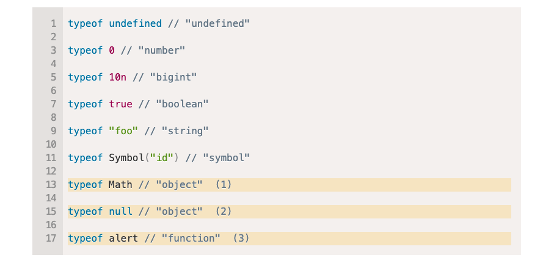

# Các kiểu dữ liệu trong Javascript 🎉

| #   | Data Type | Desc                                                                         |
| --- | --------- | ---------------------------------------------------------------------------- |
| 1   | number    | int or float, integers are limited by `±(2^53-1)`                            |
| 2   | bigint    | is for integer numbers of arbitrary length.                                  |
| 3   | string    | for strings, no single character type                                        |
| 4   | boolean   | for true / false                                                             |
| 5   | null      | for unknown values – a standalone type that has a single value null.         |
| 6   | undefined | for unassigned values – a standalone type that has a single value undefined. |
| 7   | symbol    | for unique identifiers.                                                      |
| 8   | object    | `NON-Primitive` type, used for complex data structure                        |


```js
const age = 18;
const name = 'Easy Frontend';
const isActive = true;

const student = {
  name: 'Po',
  age: 18,
}

let powerfulVar; // count will be undefined
powerfulVar = 1;
powerfulVar = 'Hello';
powerfulVar = true;
powerfulVar = {
  name: 'crazy javascript =)))'
};
```


## typeof operator



> Tham khảo: [https://javascript.info/types](https://javascript.info/types)

<DocsJSFooter />